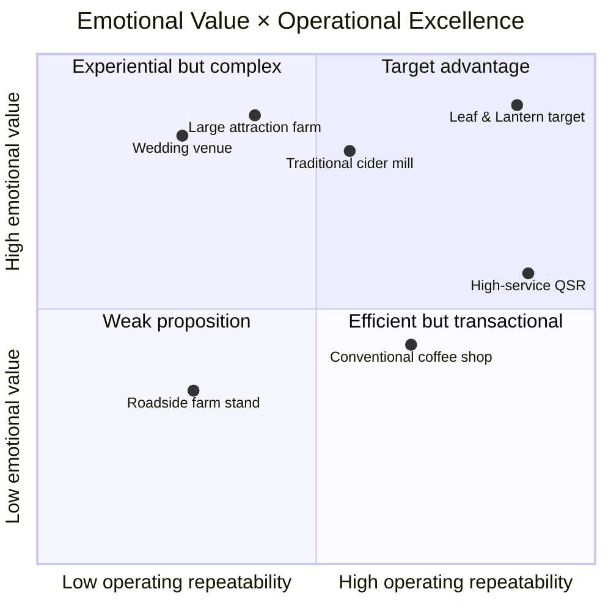
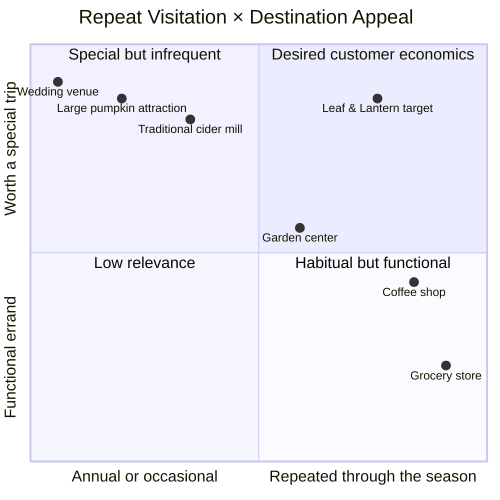
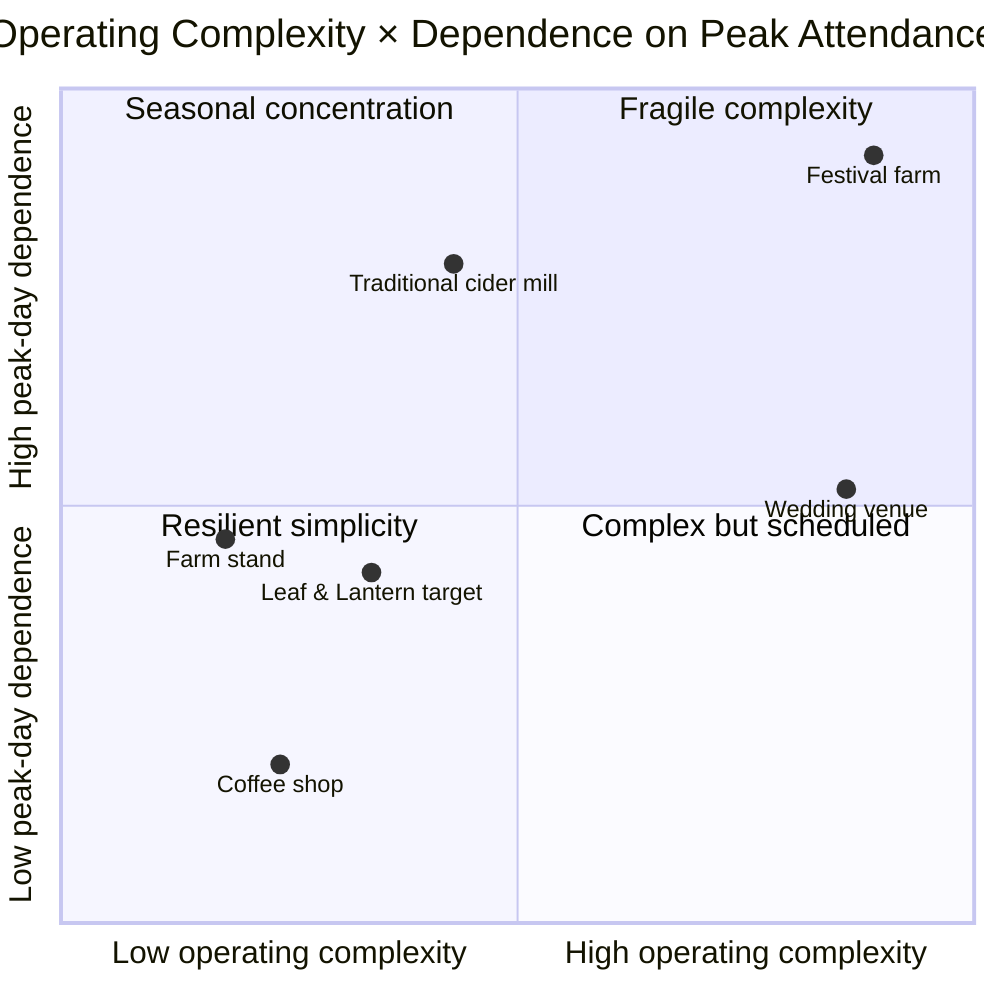
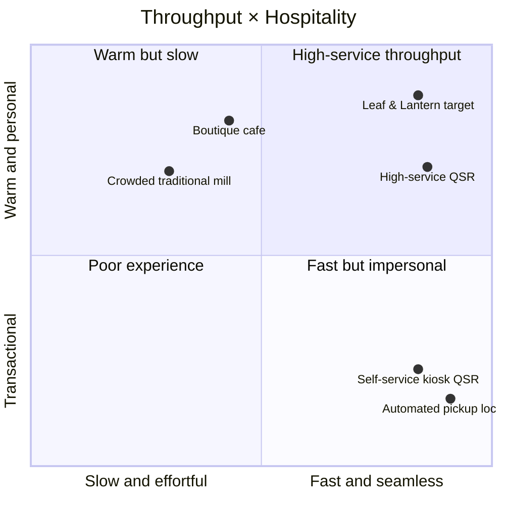
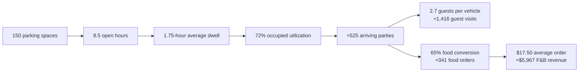

# Leaf & Lantern Investor Thesis and Strategy-Map Research

## Executive summary

Leaf & Lantern’s investor site has already made the essential strategic pivot: it now describes a food-led seasonal hospitality business rather than a sprawling agritourism campus or private-event venue. The site explicitly prioritizes emotional value, operating discipline, repeat visits, free admission, a small hero-product menu, one adaptable building, and operator-controlled programming. It also excludes weddings and banquet operations, targets a $2.5–$3.0 million startup budget excluding land, and presents four conceptual strategy maps. The strategic direction is therefore substantially clarified; the remaining work is to **compress the thesis, distinguish target positioning from proven performance, and reconcile the financial model with the low-complexity narrative**. citeturn0view0turn1view0

### Recommended investor-ready thesis

> **Leaf & Lantern is a capital-disciplined seasonal hospitality concept that converts the emotional pull of a Michigan cider mill into repeat visitation through exceptional hero products, fast human service, and one flexible operating footprint.**

**Elaboration:** Unlike attraction farms and event venues, Leaf & Lantern is designed to earn through frequent food-led visits and standardized, operator-controlled programming—not acreage, gate fees, bespoke events, or a few crowd-dependent peak days. The investment proposition is that destination-level emotional value can coexist with modern operating discipline at materially lower complexity and capital intensity than adjacent destination models.

The strongest shorthand remains:

> **Destination emotion. Everyday operating discipline. Built for return visits.**

That wording is slightly stronger than “built for repeat visits rather than maximum attendance” because it does not imply that attendance is unimportant. The model still requires substantial traffic; its distinction is that attendance is monetized through repeatable transactions rather than admissions and attraction density.

The comparable research supports the **direction** of this thesis. Product-first cider mills such as Franklin and Yates demonstrate that cider, donuts, visible production, preorders, and bulk orders can themselves be destination products. Plymouth’s separate quick-stop market and Carter Mountain’s drive-through show that convenience channels can extend demand without turning the entire property into a high-dwell attraction. Conversely, Blake’s, Wiard’s, Uncle John’s, Eckert’s, and Linvilla illustrate how extended seasons are often achieved by accumulating attractions, food outlets, event calendars, and specialized operating zones. citeturn3search0turn4search0turn4search21turn5search20turn2search4turn2search13turn2search2turn4search9turn5search9turn11search35

The research does **not** yet validate the site’s transaction, attendance, staffing, or capital assumptions. Most private orchard and farm-market operators do not publish annual attendance, average checks, revenue mix, payroll, construction cost, or parking productivity. Their official sites are useful for comparing operating models, calendars, pricing mechanics, and product breadth, but not for underwriting Leaf & Lantern’s volume. The next phase must therefore be observational and experimental: parking counts, dwell-time studies, queue and transaction counts, operator interviews, and Leaf & Lantern pilot data.

Three material issues should be resolved before presenting the current projections as investor-rooted:

| Finding | Investor implication |
|---|---|
| The narrative is food-led, but food and beverage represents only about **54% of Year One revenue**; camps, education, programs, retreats, and vendor fees contribute about **30%**. | The financial model is more programming-dependent—and therefore more operationally complex—than the thesis presently suggests. |
| The plan states 55,000 food transactions and at least 60% party conversion. Taken literally, that implies approximately **91,700 visiting parties** before accounting for drive-up orders. | The site should disclose the implied physical attendance and parking burden, not only the transaction count. |
| The retail bridge states that roughly 22% of visiting parties spend about $50, producing approximately $216,000. That arithmetic does not reconcile with the transaction and conversion assumptions. | The revenue bridge needs a single, consistent definition of visitors, parties, orders, baskets, and conversion. |

The site’s Year Three economics are not inherently implausible: $103,000 of pre-tax profit on $2.303 million of revenue is approximately 4.5%, close to the National Restaurant Association’s 4.0% median for limited-service restaurants in 2024. However, the plan reaches that result while holding annual payroll fixed at $650,000 as food transactions rise from 55,000 to 85,000, making labor productivity—not simply demand—the hidden central underwriting assumption. citeturn1view0turn9search1turn9search4

## Investor-site audit and refined thesis

The site’s thesis is now prominent and internally coherent. Its opening line—“High emotional value. High operational discipline. Built for repeat visits rather than maximum attendance”—is followed by a full explanation that contrasts hero products, fast personable service, comfortable grounds, curated retail, and repeatable programming with acreage, attractions, weddings, and festivals. Free admission, the exclusion of banquets, a smaller 3,500–5,500-square-foot building, and one multi-use hall reinforce the same argument. citeturn0view0turn1view0

The central remaining weakness is **evidentiary grammar**. The site often describes Leaf & Lantern as though it already occupies the favorable corner of each map. It does not yet. Repeat visitation, operational excellence, 100 transactions per line per hour, eight-to-ten-minute handoffs, 15–25% preorder adoption, and a sustained $16–$18 food transaction are pilot-stage hypotheses. The strategy maps should therefore label the Leaf & Lantern point **“Target position—pilot validation required.”** The current roadmap appropriately treats these as validation gates, but the plots should carry the same qualification. citeturn1view0

The phrase **“materially below attraction- and event-driven competitors”** also needs a defined denominator. A $2.95 million startup budget excluding land may be lower than the site’s earlier $4 million campus concept, but it is not automatically “low capital” in absolute terms. At the current Year Three revenue forecast, startup capital excluding land equals approximately 1.28 times annual revenue. That may be acceptable, but it must be compared using metrics such as startup capital per annual transaction, capital per dollar of stabilized revenue, sitework per parking space, and debt service per food order. citeturn0view0turn1view0

The financial mix also partially contradicts the concise thesis. The Year One model contains $963,000 of food and beverage, $280,000 of retail and pumpkins, $330,000 of camps and education, and $205,000 of programs, retreats, and vendor fees. Food and beverage is therefore 54.2% of revenue, while education and programming together are 30.1%. By Year Three, food rises to 64.6%, but the non-food program assumptions remain fixed rather than ramping from a pilot base. citeturn1view0

This does not mean the programming should be removed. It means the investor thesis should distinguish among three economic layers:

| Economic layer | Strategic role | Underwriting treatment |
|---|---|---|
| Hero food and drink | The recurring demand engine | Must support the property under the base case |
| Curated retail and take-home products | Basket expansion and seasonal relevance | Should share the same traffic, staff, storage, and brand |
| Camps, education, workshops, and limited programs | Off-peak utilization and reasons to return | Should improve returns, but not rescue an insufficient food business |

The cleanest investor framing is therefore:

> **The food business must justify the destination; programming improves utilization rather than compensating for weak core demand.**

That statement should become an explicit financial-model principle. A downside case should reduce camps, education, markets, and retreat revenue by 50% and show whether the permanent-site model still covers property-level operating costs and a meaningful portion of debt service. If it cannot, Leaf & Lantern is still partly an education-and-program venue, regardless of how the narrative describes it.

The low-complexity claim should likewise be defined comparatively rather than absolutely. Leaf & Lantern will still operate food production, coffee service, retail, parking, grounds, camps, school visits, workshops, markets, seasonal staffing, online ordering, and holiday preorders. Its defensible claim is not “simple”; it is **simpler and more standardized than attraction farms and bespoke event venues at equivalent destination value**.

## Comparable evidence

The fifteen destination comparables do not reveal private economics, but they establish several important operating patterns.

**Hero products can anchor destination demand.** Franklin emphasizes fresh cider pressing, visible donut production, seasonal atmosphere, daily fall operations, online ordering, and bulk event orders. Yates has formal large-order and individually packaged channels. Parmenter’s leads with traditional cider-mill products while an adjacent winery and brewery extends the visit. These operators demonstrate that a narrow set of recognizable products can serve as the category signal and primary trip trigger. citeturn3search0turn3search18turn4search0turn4search10turn11search8turn11search20

**Convenience can be added without converting admission into a reservation system.** Plymouth’s Red Shed Market is positioned as an easy, close-parking stop for cider, donuts, pies, office break rooms, game days, and family dinners. Carter Mountain has operated a drive-through channel for apples, pumpkins, cider, donuts, and pies. Three Cedars advertises a weekend express channel for its fresh donuts and cider. These are direct precedents for Leaf & Lantern’s order-ahead and express-collection strategy. citeturn4search21turn5search20turn3search7

**Extending the season frequently adds operating layers.** Blake combines a cider mill, more than twenty-five Funland activities, U-pick, a tasting room, restaurants, camps, festivals, workshops, and multiple locations. Uncle John’s operates a cider mill, gift shop, pie barn, taproom, cider yard, live music, trails, a jumping pillow, gemstone mining, a maze, rides, and a pumpkin patch. Eckert’s combines farm stores, restaurants, donut and custard operations, pick-your-own, concerts, classes, festivals, holiday activities, and multiple farms. Linvilla similarly layers a farm market, garden center, bakery, café, grill, beer garden, animals, fishing, pick-your-own, festivals, and classes. These businesses validate multi-season demand, but they also show why “more seasons” can quietly become “more businesses.” citeturn2search1turn2search4turn2search7turn2search13turn4search9turn4search16turn5search3turn5search9turn5search12turn11search3turn11search35

**Market-and-bakery infrastructure is a stronger adjacent model than a pure event venue.** Westview keeps its farm market and bakery open daily and layers winery and farm activities around that base. Mercier operates a market and bakery throughout most of the year, with U-pick, wine, hard cider, and family events as extensions. Robinette’s combines bakery, lunch counter, cider mill, dining, market, winery, and seasonal activities. These models support Leaf & Lantern’s premise that the kitchen and market should remain useful when no special program is underway. citeturn2search3turn2search9turn5search1turn5search4turn5search16turn4search5turn4search15

**The event-venue comparison is a real warning, not merely a branding preference.** Zingerman’s confirmed that Cornman Farms will close after its 2026 season. Its management cited reduced leads and bookings, increased costs, operational complexity, and a shift toward smaller gatherings; regional reporting stated that revenue had fallen materially below the level required to break even. Cornman’s closure does not prove that all event venues are unattractive, but it provides unusually relevant local evidence that polished hospitality and a strong parent brand do not remove the risks of bespoke, labor-intensive event economics. citeturn8search0turn8search7turn8search11

The five hospitality operating comparables reinforce a second set of principles:

| Operator | Relevant operating principle | Leaf & Lantern application |
|---|---|---|
| Chick-fil-A | Multiple ordering and pickup channels are paired with local, hands-on operators and a service-centered culture. | Use digital ordering to simplify flow while retaining a visible human handoff. citeturn6search26turn6search30 |
| Trader Joe’s | A deliberately limited assortment and rotating seasonal products create editing, discovery, and reasons to revisit. | Curate fewer, more distinctive products rather than building a large general store. citeturn6search27turn6search7 |
| In-N-Out | A narrow core menu, freshness, cleanliness, training, and service form a consistent operating promise. | Keep hero products operationally repetitive and resist menu proliferation. citeturn6search8turn6search24turn6search32 |
| Culver’s | Standardized restaurant systems coexist with owner presence and “hometown hospitality.” | Build repeatable service routines without making the experience feel automated or corporate. citeturn6search17turn6search29turn6search33 |
| Dutch Bros | The company explicitly organizes its drive-through model around speed, quality, service, and people-centered interaction; its filings also track transaction growth as a central operating outcome. | Measure transactions and throughput while treating staff interaction as part of the product. citeturn7search0turn7search7turn7search9 |

The resulting strategic conclusion is not that Leaf & Lantern should imitate any one comparable. It should combine specific mechanics: Franklin’s visible hero-product production, Yates’s bulk-order discipline, Plymouth’s quick-stop convenience, Trader Joe’s editing and seasonal cadence, and Dutch Bros or Chick-fil-A’s combination of throughput and human service. It should avoid copying the cumulative attraction density of the largest farms or the bespoke service model of premium event venues.

## Strategy plots

All four plots should be presented as **conceptual strategy maps**. Their value is explanatory, not statistical. The coordinates below are illustrative assessments based on the documented operating models, and the Leaf & Lantern point is a target position rather than an observed result.

**Emotional Value × Operational Excellence**

The traditional cider mill sits high on emotional value because of heritage, seasonality, visible production, and ritual, but only midrange on repeatable operations because many are short-season, weather-sensitive, and concentrated around autumn peaks. Attraction farms move higher emotionally but leftward operationally as rides, ticketing, U-pick, food vendors, entertainment, and dispersed activity zones accumulate. Event venues can deliver exceptional emotional value, but their customization, sales cycles, planning labor, catering, and turnover make them less repeatable. High-service QSR operators occupy the opposite position: strong systems and throughput, but less seasonal or place-based emotion. Leaf & Lantern’s target is to combine the cider mill’s emotional assets with a limited menu, dedicated pickup, managed ordering, visible production, standardized programming, and one adaptable footprint. citeturn3search0turn2search4turn2search13turn4search9turn8search8turn7search7turn0view0

**Recommended annotation beneath the plot:**

> **Most seasonal destinations add emotional value by adding activities. Leaf & Lantern is designed to add emotional value while removing operational friction.**

That is the strongest primary map because it conveys both the customer proposition and the operating thesis in one picture. The horizontal axis should be called **“operating repeatability”** or **“standardized operating excellence,”** not simply “operational excellence.” A premium wedding venue may be operationally excellent at executing weddings, but its output is still bespoke. “Repeatability” makes the intended distinction more precise.

**Repeat Visitation × Destination Appeal**

This map expresses the customer-economics hypothesis most directly. A wedding venue has high destination value but negligible repeat frequency for the same household. A large pumpkin attraction can be a highly anticipated annual outing but may exhaust its relevance in one visit. Coffee shops and grocery stores receive frequent visits but usually have lower destination pull. A traditional cider mill is special, but its narrow season and relatively static visit pattern often limit frequency. Leaf & Lantern seeks the upper-right by preserving destination appeal while creating multiple reasons to return: hero-product purchases, take-home and office orders, changing seasonal retail, schools and camps, workshops, and a small number of signature programs. Official comparable calendars show that seasonal change and product rotation can create repeat occasions, but Leaf & Lantern’s actual household frequency remains unproven until pilots produce customer-level cohort data. citeturn3search0turn11search0turn2search7turn5search12turn6search7turn0view0turn1view0

**Recommended annotation beneath the plot:**

> **The goal is not simply to become a place people will drive to. It is to become a place they remain willing to drive to several times in the same season.**

This plot should not claim “habitual” visitation in the same sense as a coffee shop. “Repeated through the season” is more credible. The pilot question is whether a meaningful share of households returns for a second and third food purchase without requiring a new paid event every time.

**Operating Complexity × Dependence on Peak Attendance**

A festival farm combines high operating complexity with dependence on a limited set of high-volume dates. A traditional seasonal mill may be operationally narrower, but a large share of its annual opportunity is still concentrated into a short autumn window. A wedding venue is highly complex but less dependent on simultaneous crowds; its risk is instead concentrated in a finite number of high-value bookings, long lead times, and customized execution. A coffee shop has comparatively steady traffic and standardized output. Leaf & Lantern cannot credibly occupy the extreme lower-left because October remains economically important and the plan still includes education, markets, grounds, retail, and programming. Its plausible target is **low-to-moderate complexity with moderated—not eliminated—peak dependence**. citeturn3search0turn11search16turn2search4turn2search13turn8search11turn1view0

**Recommended annotation beneath the plot:**

> **Diversify the use of the same assets, not the number of businesses being operated.**

The practical test is whether each non-autumn activity uses the same building, staff capabilities, checkout systems, storage, and customer audience. A program that requires a separate sales function, specialized kitchen, dedicated furniture inventory, unique staffing model, or significant public-hour displacement should be treated as strategic drift.

**Throughput × Hospitality**

This is the most operationally actionable map. Boutique cafés can provide atmosphere and personal service but may sacrifice speed when menus, drink customization, and production steps expand. Automated pickup systems deliver throughput but remove the relational moment. High-service QSR and drive-through beverage operators demonstrate that speed and staff warmth are not mutually exclusive: Chick-fil-A organizes digital and physical ordering around pickup choices and local operators, while Dutch Bros defines its model around speed, quality, service, and people-centered interaction. Leaf & Lantern’s operating mechanisms should be printed directly beside its point: **short menu, visible production, order ahead, separate staffed pickup, express bulk collection, one price list, and human handoff**. citeturn6search26turn6search30turn7search7turn7search9turn1view0

**Recommended annotation beneath the plot:**

> **Technology should remove uncertainty and waiting—not the staff interaction that makes the visit feel cared for.**

The strategy maps can be summarized in one directional comparison table. The categories are intentionally qualitative because private comparable economics are not publicly disclosed.

| Category | Typical household attendance frequency | Average-ticket character | Food share of revenue | Capital intensity | Staffing complexity |
|---|---|---|---|---|---|
| Traditional cider mill | One or a few visits in autumn | Low-to-moderate family basket | High | Low-to-medium if using legacy assets | Moderate, sharply seasonal |
| Large attraction farm | Usually annual or event-driven | Moderate-to-high after admission and activities | Moderate | High | High; dispersed and seasonal |
| Wedding/event venue | Rare, occasion-based | Very high contract value | Variable; often bundled with service | High | Very high and bespoke |
| Coffee or high-service QSR | Weekly to monthly | Low-to-moderate order | Very high | Medium to high, but standardized | High volume but repeatable |
| Farm market/garden-center hybrid | Several visits by season | Moderate-to-high retail basket | Low-to-moderate | Medium | Moderate; inventory-intensive |
| Leaf & Lantern target | Several visits across and within seasons | **$16–$18 food order target** | **54% Year One, rising to 65% Year Three in the present plan** | **$2.95M excluding land; medium-high in absolute terms** | Moderate, with six functions and 35–55 peak seasonal staff |

Leaf & Lantern’s target row reveals the key underwriting tension. It seeks QSR-like repeatability, but its current staffing and revenue mix remain closer to a hybrid destination. The strategy is credible only if the hybrid elements operate through shared infrastructure rather than becoming independent departments. Leaf & Lantern’s target transaction, capital, revenue-mix, and staffing figures come from the current investor site. citeturn1view0

## Capacity-driven unit economics

The investor site has appropriately shifted from “attendance” toward food transactions, but transactions cannot replace physical capacity in the operating model. Parking, dwell time, party size, conversion, food production, checkout, pickup, restrooms, and circulation collectively determine the number of transactions the property can support.

The core capacity equation should be stated as:

\[
\text{Party arrivals}
=
\text{Parking spaces}
\times
\frac{\text{Open hours}}{\text{Average dwell hours}}
\times
\text{Occupied utilization}
\]

\[
\text{Guest visits}
=
\text{Party arrivals}
\times
\text{Guests per arriving vehicle}
\]

\[
\text{Food transactions}
=
\text{Party arrivals}
\times
\text{Food conversion}
+
\text{Express transactions not consuming normal dwell}
\]

\[
\text{Food revenue}
=
\text{Food transactions}
\times
\text{Average food transaction}
\]

An illustrative base-day capacity bridge—not a forecast—is:

The assumptions in this example produce approximately 525 arriving vehicle-parties, 1,416 guest visits, 341 food transactions, and $5,967 in food-and-beverage revenue. They also produce about $6.50 of food revenue per occupied parking-space-hour:

\[
\$5{,}967 \div (525 \times 1.75) \approx \$6.50
\]

A sensitivity envelope shows how strongly the economics respond to dwell time, conversion, and ticket size:

| Capacity input or output | Lower case | Illustrative base | Upper operating case |
|---|---:|---:|---:|
| Parking spaces | 120 | 150 | 180 |
| Open hours | 8.0 | 8.5 | 9.0 |
| Average dwell | 2.25 hr | 1.75 hr | 1.50 hr |
| Occupied utilization | 60% | 72% | 85% |
| Guests per vehicle | 2.4 | 2.7 | 2.9 |
| Food conversion | 55% | 65% | 75% |
| Average food order | $16.00 | $17.50 | $20.00 |
| Arriving parties/day | 256 | 525 | 918 |
| Guest visits/day | 614 | 1,416 | 2,662 |
| Food orders/day | 141 | 341 | 689 |
| Food revenue/day | $2,253 | $5,967 | $13,770 |
| Food revenue per occupied space-hour | $3.91 | $6.50 | $10.00 |

The table is a capacity range, not a demand forecast. The upper case would represent a very busy operating day and would require production, parking ingress, restrooms, order capture, pickup, and grounds circulation to remain functional at more than 2,600 guest visits. That would not necessarily feel “small-scale” even if the building itself is modest.

The current Year One food forecast can be reconstructed as an illustrative day-type model:

| Operating-day type | Days | Average food transactions | Annual transactions |
|---|---:|---:|---:|
| Peak autumn or holiday days | 30 | 650 | 19,500 |
| Shoulder weekends and strong program days | 45 | 350 | 15,750 |
| Ordinary weekdays and lower-volume days | 120 | 165 | 19,800 |
| **Total** | **195** |  | **55,050** |

At $17.50 per transaction, that produces approximately $963,000, matching the Year One food-and-beverage line. The value of this bridge is not that these are the correct day types; it is that management can now ask whether 650 peak-day transactions, 350 shoulder-day transactions, and 165 ordinary-day transactions are physically and commercially defensible. The current site provides the 55,000-transaction and $17.50 assumptions but does not yet supply this daily bridge. citeturn0view0turn1view0

A 650-transaction peak day exposes the relationship between parking and order ahead. At 65% conversion, 650 on-site orders would imply 1,000 arriving parties. With a 1.75-hour dwell, those parties consume 1,750 occupied parking-space-hours. Even 180 spaces operating for 8.5 hours at 85% utilization provide only about 1,301 occupied space-hours. Under those assumptions, approximately one-quarter of peak transactions would need to come through a genuinely low-dwell or no-normal-parking channel.

This distinction is critical:

> **Order ahead smooths kitchen demand, but it does not create parking capacity when preorder customers park and remain on the property for the same length of time as walk-up guests.**

The express drive-up channel, office orders, school orders, and true grab-and-go purchases are what improve parking productivity. A dedicated pickup counter improves service and queue flow; it only improves site capacity if it also reduces dwell or avoids ordinary parking. Three Cedars’ express operation, Plymouth’s close-parking quick-stop market, Yates’s structured bulk ordering, and Carter Mountain’s drive-through provide practical precedents. citeturn3search7turn4search21turn4search0turn4search10turn5search20

### Projection reconciliation

The current revenue bridge contains a material mathematical inconsistency. The plan states:

- 55,000 food transactions;
- at least 60% of visiting parties purchasing food or drink;
- approximately 22% of visiting parties adding retail at about $50;
- approximately $216,000 of retail basket revenue, before pumpkins. citeturn1view0

If 55,000 food transactions represent one buying order per converted party, then:

\[
55{,}000 \div 60\% = 91{,}667 \text{ visiting parties}
\]

At a 22% retail conversion and $50 basket:

\[
91{,}667 \times 22\% \times \$50
=
\$1.008\text{ million}
\]

Conversely, $216,000 of retail revenue at 22% conversion and a $50 average basket implies only:

\[
\$216{,}000 \div (22\% \times \$50)
=
19{,}636 \text{ visiting parties}
\]

Those two implied party counts differ by more than fourfold. The likely resolution is that “22% of visiting parties,” “$50 average,” or the relationship between food transactions and parties is defined incorrectly. This must be corrected before investors rely on the bottom-up bridge.

The implied attendance should also be shown. Before accounting for drive-up or off-site bulk orders, 91,667 parties at an illustrative 2.7 guests per party would mean approximately 247,500 annual guest visits. That is not necessarily infeasible, but it changes the interpretation of “small-scale.” The site presently emphasizes 55,000 transactions, which sounds materially smaller than the physical attendance required under its own conversion assumption.

A revised model should separately define:

| Term | Required definition |
|---|---|
| Guest visit | One person entering the public property |
| Arriving party | One household or group arriving together |
| Vehicle-party | One arriving party consuming a parking space |
| Food order | One completed food-and-beverage transaction |
| Retail basket | One separate or combined retail purchase |
| Program participant | One paid camp, school, workshop, or event attendee |
| Express order | A transaction with no normal-duration parking stay |
| Conversion | Buying parties divided by eligible arriving parties—not guests |

The model should then separate three traffic channels: ordinary on-site parties, short-dwell pickup parties, and drive-up or bulk orders that do not consume a normal parking stay.

The payroll model needs similar treatment. Payroll remains $650,000 from Year One through Year Three while annual food transactions rise by 54.5%, from 55,000 to 85,000. Payroll therefore falls from 36.6% to 28.2% of total revenue without an absolute increase. That may be possible if Year One carries substantial unused capacity, but it is a major operating-leverage assumption and should be demonstrated through a labor-hour model. National Restaurant Association data show median labor and benefits of 31.7% of sales for limited-service respondents in 2024 and 30.0% among profitable limited-service respondents, illustrating how consequential a few payroll points are. citeturn1view0turn9search1

The Year Three bottom line is more credible than the EBITDA headline alone might suggest. EBITDA is $373,000, or 16.2% of revenue, but after the site’s depreciation and interest assumptions, pre-tax profit is $103,000, or approximately 4.5%. The National Restaurant Association reported a 4.0% median pre-tax margin for limited-service restaurants in 2024. EBITDA and restaurant pre-tax income are not interchangeable, but the comparison indicates that the plan’s eventual net economics are not unusually rich; the more aggressive assumptions are the transaction ramp and fixed payroll. citeturn1view0turn9search4turn9search10

## Metrics and validation

The operating dashboard should contain eight strategic metrics. Each should have a precise denominator, a baseline from pilots, and separate reporting for autumn peaks, ordinary public days, and programs.

| Metric | Recommended definition | Why it matters |
|---|---|---|
| **Same-season repeat visits per identified household** | Number of visits or purchases by loyalty-identified households, with cohorts for one, two, three, and four-plus visits | Directly tests the central investment thesis rather than relying on stated intent |
| **Average food transaction** | Gross food and nonalcoholic beverage sales divided by completed food orders, reported with median and distribution | Tests the $16–$18 target and reveals whether the average is supported broadly or by a small number of bulk orders |
| **Food and beverage share of revenue and gross profit** | F&B revenue and contribution margin divided by total revenue and total contribution | Shows whether hero food is actually the economic engine |
| **Party food-conversion rate** | On-site parties purchasing food divided by total eligible on-site parties | Connects guest traffic to monetization and clarifies the free-admission model |
| **Orders per direct labor hour** | Completed food orders divided by kitchen, counter, pickup, and beverage labor hours | Measures whether transaction growth creates operating leverage |
| **Preorder and express mix** | Report staffed-pickup preorders, short-dwell pickup, drive-up, office orders, and school bulk orders separately | Distinguishes kitchen smoothing from genuine parking-capacity relief |
| **Revenue per occupied parking-space-hour** | On-site revenue divided by measured occupied parking-space-hours; report express revenue separately | Integrates dwell, conversion, basket size, and site productivity |
| **NPS plus observed return behavior** | Standard NPS survey paired with actual ninety-day and same-season repeat rates | Keeps customer sentiment from substituting for behavior |

Bain’s Net Promoter guidance emphasizes consistent measurement and warns that survey method can materially change the result. Bain also advises looking beyond stated feedback to repeat purchases and referrals. Leaf & Lantern should therefore treat NPS as a diagnostic, not the primary proof of loyalty. citeturn9search2turn9search11turn9search14

Peak handoff time, order accuracy, abandonment, stockouts, and parking queue time should remain operating service-level measures, even if they sit beneath the eight strategic metrics. The site’s proposed eight-to-ten-minute handoff and 100 transactions per active line per hour should be measured at the ninetieth percentile, not only as an average. Averages can conceal the exact periods when crowding damages the brand. citeturn1view0

The most useful investor dashboard would connect the metrics rather than presenting them independently:

\[
\text{Repeat households}
\times
\text{visits per household}
\times
\text{conversion}
\times
\text{average transaction}
=
\text{core food revenue}
\]

\[
\text{Orders}
\div
\text{direct labor hours}
=
\text{labor productivity}
\]

\[
\text{Revenue}
\div
\text{occupied parking-space-hours}
=
\text{site productivity}
\]

This structure makes it possible to diagnose whether underperformance comes from insufficient household reach, weak return frequency, low food conversion, inadequate basket size, excessive dwell, or labor inefficiency.

## Source register and next research steps

The research prioritized official operator sites, government data, public filings, company investor materials, and first-party operating statements. The destination source set comprises fifteen food-focused orchard, cider-mill, farm-market, and seasonal destination operators:

| Comparable | Evidence used |
|---|---|
| Blake Farms | Cider mill, tasting room, restaurants, more than twenty-five family activities, camps, classes, festivals, and year-round extensions. citeturn2search1turn2search4turn2search7turn2search13 |
| Wiard’s Orchards | Ticketed Country Fair, free-access store, attractions, bakery, seasonal staffing, and fall concentration. citeturn2search0turn2search2turn2search14turn2search17 |
| Westview Orchards & Winery | Daily market and bakery, winery, farm activities, admissions, and event rentals. citeturn2search3turn2search9turn2search18turn2search24 |
| Franklin Cider Mill | Short autumn season, visible pressing and donut production, market, atmosphere, online and bulk ordering. citeturn3search0turn3search18 |
| Three Cedars Farm | Free admission, cider-and-donut focus, seasonal activities, Christmas extension, and weekend express service. citeturn3search1turn3search7turn3search10 |
| Plymouth Orchards | Food-led orchard visit, school tours, rentals, wagon rides, and a separate convenient quick-stop market. citeturn4search1turn4search4turn4search7turn4search21 |
| Yates Cider Mill | Hero-product identity, structured large orders, corporate orders, individual packaging, and party products. citeturn4search0turn4search3turn4search6turn4search10 |
| Spicer Orchards | Daily market and winery, U-pick, races and activities, shipping, and an explicit reluctance to become a wedding operator. citeturn3search2turn3search5turn3search15 |
| Uncle John’s Cider Mill | Multiple retail and food barns, taproom, entertainment, attractions, and the historical progression from cider and donuts into “agritainment.” citeturn4search9turn4search16turn4search23 |
| Robinette’s Apple Haus | Bakery, lunch counter, cider mill, dining, market, winery, free orchard entry, and paid seasonal activities. citeturn4search5turn4search8turn4search15turn4search22 |
| Parmenter’s Northville Cider Mill | Autumn cider-mill products, free parking and family grounds, plus an adjacent year-round winery and brewery. citeturn11search0turn11search8turn11search20 |
| Eckert’s | Multi-location, spring-to-winter model integrating market, restaurant, donut shop, U-pick, concerts, classes, festivals, and holidays. citeturn5search3turn5search9turn5search12 |
| Mercier Orchards | Near-year-round market and bakery, broad packaged-food assortment, U-pick, hard cider, wine, and family events. citeturn5search1turn5search4turn5search16 |
| Carter Mountain Orchard | Destination bakery and cider donuts, seasonal admission, country store, beverage outlets, and drive-through product collection. citeturn5search2turn5search14turn5search20turn5search29 |
| Linvilla Orchards | Farm market, garden center, bakery, café, grill, beer garden, activities, classes, and a dense seasonal calendar. citeturn11search3turn11search7turn11search19turn11search35 |

The hospitality operating source set comprises Chick-fil-A, Trader Joe’s, In-N-Out, Culver’s, and Dutch Bros, using official company materials and, for Dutch Bros, SEC filings. These sources support the operating principles of human-centered service, limited assortments, freshness, local ownership or operator presence, training, multiple ordering channels, speed, and transaction-level measurement. citeturn6search26turn6search27turn6search24turn6search17turn7search9

Industry context came from the National Restaurant Association’s operating data, USDA direct-market and agricultural census materials, and Bain’s Net Promoter research. USDA reported $17.5 billion in food sold through direct marketing channels in the 2022 Census of Agriculture, a real increase from 2017, while the National Restaurant Association’s 2024 operating data underscore that labor, food costs, and thin pre-tax margins remain central constraints. citeturn9search0turn9search6turn9search1turn9search4

The next research phase should be narrower and more empirical than another online comparable survey.

**Local field audit.** Conduct repeated observational audits at Franklin, Parmenter’s, Plymouth, Yates, Three Cedars, Wiard’s, Westview, and one larger attraction farm. On selected ordinary and peak dates, record opening hours, parking inventory, occupied spaces at fifteen-minute intervals, observed vehicle turnover, estimated party size, queue length, order and handoff times, visible service lines, product pricing, ordering channels, and weather. The purpose is not to reverse-engineer confidential revenue; it is to create defensible physical capacity ranges.

**Operator interviews.** Seek confidential or anonymized interviews with five to eight operators, equipment vendors, former seasonal managers, or industry advisers. The priority questions are peak orders per hour, donut-line output, percentage of sales in dozens versus singles, cider volume, average dwell, seasonal payroll, hiring and training burden, preorder adoption, weather-loss patterns, and the operational activities they regret adding.

**Pilot transaction study.** Each Leaf & Lantern pop-up should use the same core menu architecture proposed for the permanent site. Capture unique household identifiers, order channel, order time, promised pickup time, actual handoff time, basket contents, party size, travel ZIP code, repeat purchase, direct labor hours, waste, and customer feedback. At least one pilot should be free-access and not attached to a large festival so that food conversion can be observed without an event artificially generating traffic.

**Parking-and-dwell experiment.** Measure whether preorder customers actually stay for less time. If order-ahead customers collect food and then spend an hour on the grounds, preorder adoption will help the kitchen but not the parking constraint. Test a separate express collection design for office orders, school orders, gallons, half-gallons, dozens, and bundles.

**Capital benchmark.** Replace the general “lower capital” claim with contractor- and equipment-supported ratios: building cost per conditioned square foot, sitework and utility cost per parcel, parking and stormwater cost per space, kitchen equipment per peak hourly order, total startup capital per stabilized annual transaction, and annual debt service per order. Compare adaptive reuse, ground lease, and land-purchase cases independently.

**Financial downside cases.** Add at least four sensitivities: food transactions at 40,000, 55,000, 70,000, and 85,000; average ticket at $15, $17.50, and $20; programs and education at 50%, 75%, and 100% of plan; and payroll that scales with orders rather than remaining flat. The investment thesis should survive a weak-program case and a poor-autumn-weather case without requiring weddings, a gate fee, or a larger attraction package.

The decisive next-stage question is therefore not merely whether comparable destinations attract large crowds. It is:

> **Can Leaf & Lantern produce enough repeat food transactions per parking-space-hour and per labor hour to support a $2.5–$3.0 million property without becoming an attraction farm or event venue?**

The current site gives a strong strategic answer. The next phase must provide the measured operating answer.