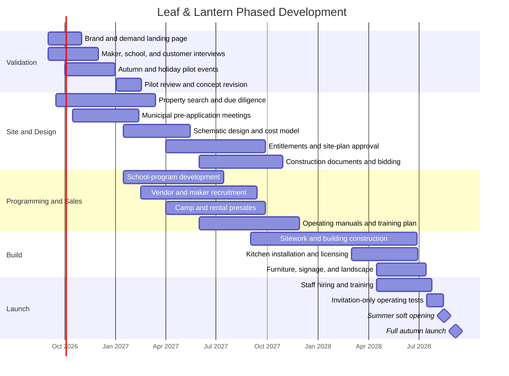

# Leaf & Lantern Complete Business Plan and Website Handoff

## Executive Summary

Leaf & Lantern should be developed as a **small-scale, seasonally defined Michigan gathering place** built around food, local makers, education, and shared traditions. It should not attempt to compete with large cider mills on attraction count, crowds, rides, or acreage. Its competitive advantage is a more thoughtful experience: warm architecture, a flexible main event space, a comfortable courtyard, excellent cider and donuts, curated retail, and programming with a clear purpose in every season.

The organizing idea is:

> **Autumn is our heart, not our entire calendar.**

Each operating season has one signature experience:

| Season | Signature experience | Primary promise |
|---|---|---|
| Spring | **Discovery** | Nature, schools, gardens, and hands-on learning |
| Summer | **Gathering** | Camps, markets, music, wellness, and long evenings |
| Autumn | **Tradition** | Cider, donuts, coffee, pumpkins, and Halloween |
| Holiday | **Celebration** | Gift markets, lights, workshops, and warm seasonal hospitality |

The regional demand case is credible, provided the eventual property is within a convenient drive of a substantial Southeast Michigan population center. Wayne, Oakland, and Macomb counties together had approximately 3.94 million residents in the Census Bureau’s 2025 estimates. Oakland County’s median household income was $97,760 in the 2020–2024 period, while Livingston County’s was $103,039, supporting a potential northwestern or northern suburban market for premium but approachable family experiences. Michigan also recorded 131.2 million visitors and $30.7 billion in direct visitor spending in 2024. citeturn6search0turn6search1turn6search3turn3search0turn3search2turn0search0

The market is validated but crowded. Blake Farms has demonstrated demand for multi-season festivals, artisan markets, classes, food, wellness programming, and family activities. Wiard’s demonstrates substantial willingness to pay for a concentrated fall experience, with official 2026 prices of $18 on weekdays and $27.50 on weekends. Westview demonstrates the durability of a quieter farm-market model that combines produce, bakery, U-pick, summer hospitality, fall activities, and private rentals. citeturn2view0turn2view2turn2view4turn2view5

Leaf & Lantern should occupy the whitespace between those models:

> **More intentional than a traditional cider mill, more intimate than a festival farm, and warmer than a conventional event venue.**

The recommended opening model is a modest permanent campus centered on one adaptable main building rather than a collection of attractions. The base planning model assumes approximately 4,500–6,500 square feet of conditioned public space, a courtyard, a commercial bakery and beverage counter, a curated market, outdoor teaching areas, and enough parking and overflow capacity to handle timed peaks without making the property feel crowded.

The illustrative financial model—not a construction bid, appraisal, or lending forecast—produces the following outlook:

| Planning measure | Base assumption |
|---|---:|
| Startup requirement, excluding land | Approximately **$3.95 million** |
| First-year revenue | **$1.80 million** |
| Second-year revenue | **$2.23 million** |
| Third-year revenue | **$2.65 million** |
| First-year EBITDA | **$220,000** |
| Third-year EBITDA | **$610,000** |
| Operating cash break-even | Approximately **$1.6–$1.8 million** annual revenue |
| Cash break-even after modeled debt service | Approximately **$2.0–$2.2 million** annual revenue |
| Preferred permanent-site launch | Autumn **2027 or 2028**, depending on entitlement and construction path |

The plan should proceed only after four gates are passed: parcel-level zoning and utility feasibility; a bottom-up construction estimate; demand validation through pop-ups and advance bookings; and confirmation that food-service throughput, parking, restrooms, and accessibility can support autumn peaks without compromising the brand experience.

## Concept and Mission

**Business concept.** Leaf & Lantern is a four-season hospitality and agritourism-inspired venue focused on family traditions, local food, creative learning, community gatherings, and Michigan-made products. Agritourism commonly combines agricultural production or processing with recreational, educational, and commercial visits, while Michigan officially recognizes activities such as U-pick orchards, pumpkin patches, farm markets, roadside markets, and on-farm events as part of the category. citeturn7search1turn0search2

Leaf & Lantern does not need to operate as a large production farm to embody those values, but its offerings must remain materially connected to seasons, food, growing, making, and the landscape. The property should feel like a real place with year-round purpose—not a generic rental hall temporarily decorated for different holidays.

**Mission statement.**

> **Leaf & Lantern creates welcoming, seasonally defined experiences that help people slow down, spend time together, and enjoy the traditions, food, creativity, and natural character of Michigan.**

**Expanded brand story.**

> At Leaf & Lantern, we celebrate the traditions that make autumn worth looking forward to. We’ve brought together the best parts of the season—fresh cider, hot donuts, beautiful pumpkins, local makers, and simple experiences worth sharing—in one welcoming place.
>
> Whether you’re picking out the perfect pumpkin, enjoying a warm cup of locally roasted coffee, or spending an afternoon with family and friends, our goal is to create an autumn tradition you’ll look forward to returning to every year.
>
> Autumn may be where our story begins, but every season has something meaningful to offer. Spring invites discovery. Summer brings people together. Autumn keeps traditions alive. The holidays give us reasons to celebrate.
>
> Every season has its own rhythm, but they all share the same purpose: thoughtful hospitality, memorable experiences, and a welcoming place worth returning to.

**Positioning statement.**

> For Michigan families, schools, makers, and community groups seeking an authentic seasonal destination, Leaf & Lantern is a warm, design-conscious gathering place where food, learning, shopping, and tradition come together—without the crowds, noise, and attraction overload of a large amusement-style farm.

**Operating principles.**

| Principle | Business implication |
|---|---|
| Seasonally defined | Every event must fit Discovery, Gathering, Tradition, or Celebration. |
| Intimate rather than crowded | Timed capacity, restrained programming, and comfortable circulation take precedence over maximum attendance. |
| Food is central | Cider, donuts, coffee, bakery items, and seasonal drinks are core products, not incidental concessions. |
| Flexible rather than sprawling | One excellent adaptable building should serve camps, yoga, markets, food service, workshops, and rentals. |
| Local but edited | Makers and products are selected for quality, utility, and fit—not merely because they are local. |
| Family-friendly, not child-exclusive | Adults without children should still enjoy the architecture, coffee, markets, music, and atmosphere. |
| Warm, not kitschy | Seasonal decoration should use natural materials, light, landscape, and real products rather than excessive props. |
| Professional, not corporate | Operations, wayfinding, booking, food safety, and service should be disciplined even when the atmosphere is relaxed. |

The recommended legal and organizational structure is a for-profit operating company with the option to create a separate property-holding entity. Educational partnerships, school programs, scholarships, and community initiatives may later justify a nonprofit partner or fiscal sponsor, but the core venue should not depend on grants to sustain ordinary operations.

## Market Analysis

Because no exact parcel or municipality has been selected, this analysis is regional rather than site-specific. A final feasibility study must map population, household income, school districts, travel time, competitors, traffic counts, utilities, and zoning within thirty-, forty-five-, and sixty-minute drive-time rings.

**Regional demand thesis.** A Southeast Michigan location can draw from a large resident population, especially if positioned on a suburban-rural edge near major east-west or north-south travel routes. The combined 2025 population estimate for Wayne, Oakland, and Macomb counties was approximately 3.94 million. Oakland County alone had about 1.29 million residents, nearly one-fifth of whom were under eighteen. Macomb had about 886,000 residents, with a similar under-eighteen share. citeturn6search0turn6search1turn6search3

The year-one plan assumes approximately 40,000 paid general-admission visits plus camp, workshop, rental, café, and market visitors. Forty thousand visits equal roughly one percent of the three-county population, although this is not a true market-share calculation because some guests will visit repeatedly and others will come from outside the region. That modest penetration requirement supports feasibility, but only a parcel-level drive-time analysis can establish a defensible serviceable market.

Michigan’s broader visitor economy provides additional support. Visitors made 131.2 million trips to Michigan in 2024 and spent $30.7 billion in destinations, while the state’s official travel positioning emphasizes nature, family recreation, local shopping, food, and four-season experiences. citeturn0search0turn5search11

**Primary audiences.**

| Audience | Need state | Best Leaf & Lantern products |
|---|---|---|
| Families with children ages three to twelve | Easy, wholesome outings that feel special without requiring a full-day amusement-park commitment | Pumpkins, Halloween party, discovery days, camps, donuts, holiday workshops |
| Couples and adult friend groups | Seasonal atmosphere, good coffee and food, markets, music, and attractive surroundings | Evening markets, yoga, maker events, holiday shopping, acoustic music |
| Schools and homeschool groups | Organized, curriculum-relevant, safe field experiences | Nature, pollinator, garden, weather, food, and seasonal science programs |
| Local makers | Well-run sales opportunities with an audience that values handmade products | Curated spring, autumn, and holiday markets |
| Employers and organizations | Comfortable, distinctive small-event space | Retreats, appreciation events, workshops, holiday gatherings |
| Private hosts | A warm alternative to a banquet hall | Showers, birthdays, reunions, small receptions |
| Regional day-trippers | A reason to combine food, shopping, landscape, and seasonal activity in one trip | Signature weekends and destination markets |

School programming is especially promising because it gives spring weekdays a defined customer base. Michigan’s academic standards provide a framework that local schools use for curriculum development, allowing Leaf & Lantern programs to be explicitly mapped to science, environment, agriculture, art, and observation standards rather than marketed as generic field trips. citeturn7search11

**Competitive comparison.**

| Venue | Current model and pricing | Strengths | Strategic lesson for Leaf & Lantern |
|---|---|---|---|
| **Blake Farms, Armada area** | Large, multi-season destination with festivals, Funland, food, U-pick, classes, wellness, and artisan markets. Its 2026 Lavender Festival listed admission at $12 Friday and $14 Saturday–Sunday, 200-plus artisans, children’s programming, food, yoga, and add-on workshops. Its Sunflower Festival listed $12–$14 tickets and 100-plus artisans. citeturn2view4turn2view5 | Brand awareness, scale, multiple revenue centers, destination marketing, major vendor participation | Confirms demand for markets, workshops, wellness, food, and seasonal photo opportunities. Leaf & Lantern should borrow the revenue diversity, not the attraction density or crowd scale. |
| **Wiard’s Orchards, Ypsilanti** | Fall-centered orchard and Country Fair. Official 2026 pricing lists $18 weekday admission, $27.50 weekend admission, and a $46 season pass. The free-access Country Store supports separate food and retail purchases. citeturn2view0turn1search12turn1search15 | Long heritage, strong fall identity, broad family-attraction mix, clear paid/free zones | Demonstrates strong willingness to pay in peak autumn. Leaf & Lantern can charge for programmed weekends while preserving free market-and-café access on selected days. |
| **Westview Orchards and Winery, Washington Township** | Farm market and bakery operating from spring into early winter, U-pick, summer farm fun, weekend porch winery, fall activities, and private rentals. Fall programming includes a corn maze, wagon ride, slides, animals, play areas, and themed bale maze. citeturn2view1turn2view2 | Heritage, repeat local visits, bakery and market credibility, adult beverage component, rentals | Shows the value of a steady market-and-food base underneath seasonal programming. Leaf & Lantern should make its kitchen and market useful even when no major event is underway. |

The competitive opening is therefore not “another cider mill.” It is a **smaller, more curated seasonal institution** with stronger architecture, better indoor flexibility, restrained attendance, and clearer programming identities.

The strongest defensible advantages will be difficult-to-copy operating assets rather than novelty attractions: consistent hospitality, a recognizable visual environment, reliable food quality, relationships with schools and makers, a strong email audience, and a calendar customers learn to anticipate.

## Offerings and Operations

The calendar should have two layers. The first is a recurring base business—market, bakery, coffee, grounds, private bookings, and workshops. The second is a limited number of signature seasonal programs that create urgency without turning every weekend into a festival.

| Season | Signature | Recommended anchor offerings | Principal revenue sources |
|---|---|---|---|
| **Spring** | **Discovery** | School field trips; homeschool days; seed-starting and garden workshops; pollinator programs; nature walks; Earth Day market; family discovery weekends | Field-trip fees, workshops, café sales, retail kits, vendor fees |
| **Summer** | **Gathering** | Kids’ science and nature camps; morning yoga; evening acoustic music; small outdoor markets; family discovery days; local-food nights; private events | Camps, class passes, F&B, markets, rentals, event tickets |
| **Autumn** | **Tradition** | Cider, donuts, coffee, pumpkin selection, harvest market, family photo areas, Halloween costume party, face painting, lantern evenings, restrained hay-and-pumpkin activities | Admission, F&B, pumpkins, retail, vendor fees, sponsorships |
| **Holiday** | **Celebration** | Indoor gift market; wreath and ornament workshops; warm drinks; bakery boxes; small-business shopping evenings; family craft mornings; private holiday gatherings | Vendor fees, retail commission, F&B, workshops, rentals, ticketed evenings |

**Spring: Discovery.** Programs should be active rather than theatrical. Children might test soil, observe insects, map a garden, compare seeds, examine weather instruments, study decomposition, or build a small habitat. Field trips should be sold in fixed packages with clear grade bands, learning objectives, teacher materials, bus arrival instructions, indoor rain plans, and optional lunch or take-home kits.

**Summer: Gathering.** The main hall should convert between camp, yoga, community dining, workshop, and event configurations. Summer programming is the proof that the building is an operating asset rather than an autumn expense. Camps should remain small—approximately sixteen to twenty-four participants per cohort—so the experience feels attentive and operationally manageable.

**Autumn: Tradition.** The autumn product is deliberately simpler than a conventional farm amusement park. The emotional center is a family choosing a pumpkin, carrying cider and donuts to a table, seeing donuts made, browsing useful local goods, and enjoying a comfortable outdoor space. Halloween can be substantial without becoming a haunted attraction: costumes, face painting, music, pumpkin games, hay bales, lanterns, crafts, and a family dance or parade.

**Holiday: Celebration.** The winter gift market should be the strongest indoor retail period. Merchandise should include ceramics, textiles, wood goods, candles, pantry products, paper goods, ornaments, wreaths, children’s gifts, and Leaf & Lantern food boxes. Booth count should be limited by visual quality and circulation rather than maximized.

**Recommended public hours.**

| Period | Base hours | Programming emphasis |
|---|---|---|
| January–February | Limited public openings; rentals and planning by appointment | Corporate retreats, private events, maintenance, annual planning |
| March–May | Thursday–Sunday, approximately 9 a.m.–5 p.m.; school visits on selected weekdays | Field trips, gardens, workshops, spring market |
| June–August | Tuesday–Sunday; mornings through early evening, with selected later nights | Camps, yoga, markets, music, rentals |
| September–October | Daily or six days weekly, approximately 9 a.m.–7 p.m.; later Halloween evenings | Cider, donuts, pumpkins, harvest, Halloween |
| November–December | Thursday–Sunday, approximately 10 a.m.–7 p.m.; selected evening markets | Gift market, workshops, holiday gatherings |

Hours should remain configurable in the website content-management system; they should not be hard-coded into page templates.

**Staffing model.** The permanent operation should begin with approximately eight to ten full-time-equivalent leadership and skilled positions: general manager, operations and facilities manager, culinary manager, lead baker, market buyer/merchandiser, education and programming manager, events and rentals manager, marketing and guest-relations lead, bookkeeping/administrative support, and maintenance support. Some roles can be combined before opening.

Peak autumn staffing is likely to require thirty-five to fifty-five part-time employees across admissions, parking, guest assistance, kitchen, bakery, cleaning, retail, activities, and event support. Michigan’s minimum wage is $13.73 per hour in 2026 and is scheduled to reach $15 in 2027; therefore, the financial model should assume frontline hiring rates of approximately $16–$18 rather than budgeting at the statutory floor. citeturn5search0turn5search4

**Site layout priorities.**

| Priority | Requirement |
|---|---|
| **Arrival** | A legible but modest road sign, safe turn-in, clear parking direction, and an immediate view of one welcoming destination—not a campus skyline. |
| **Architecture** | A durable, contemporary heritage building with honest materials, a covered threshold, useful windows, and a scale closer to a lodge or workshop than an event complex. |
| **Courtyard** | The primary outdoor room: protected from traffic, visible from food service, flexible for tables, yoga, music, Halloween, and markets. |
| **Market** | Located directly on the natural arrival-to-food path; curated like a small general store or artisan hall rather than a souvenir shop. |
| **Kitchen** | Highly visible donut and bakery production, efficient coffee and cider service, separate production and guest queues, and protected pickup space. |
| **Lighting** | Warm building-mounted lanterns, understated path lighting, task lighting for markets, and selective overhead festoon lighting—never blanket carnival lighting. |
| **Back of house** | Loading, waste, refrigeration, staff parking, storage, and vendor access screened from primary guest views. |
| **Parking** | A right-sized improved lot with planned overflow rather than a vast permanent field of asphalt. |
| **Accessibility** | A continuous accessible route from parking to entrance, courtyard, restrooms, food service, market, and program areas. Federal standards define the accessible path of travel as an unobstructed connection among exterior approaches, entrances, and interior functions. citeturn9search0 |

Food-service planning should begin during schematic design, not after construction. Michigan generally requires licensing when food is processed, prepared, served, or offered for sale, and new food-service or extended-retail operations commonly require plan review. citeturn4search0turn4search4turn4search11turn4search14

Agricultural or farm-market status should not be presumed to eliminate local approvals. Michigan’s Farm Market GAAMPs explicitly note that activities can be subject to additional local, state, or federal regulation and are assessed case by case. Before property acquisition, the team should obtain written or recorded pre-application feedback on land use, assembly occupancy, retail, food service, camps, amplified sound, parking, signage, temporary structures, wastewater, stormwater, and event frequency. citeturn9search4

## Revenue Streams and Financial Plan

Leaf & Lantern should use a **mixed-access model**. Ordinary café and market days can be free, while high-demand programmed periods use admission or timed tickets. This prevents the business from placing a paywall in front of every coffee or retail visit while preserving the ability to manage autumn capacity and monetize major experiences.

**Recommended opening price architecture.** These are suggested initial prices in 2027 dollars and should be validated with local research, cost testing, and pilot events.

| Revenue stream | Suggested pricing |
|---|---:|
| Ordinary market and café access | Free |
| Spring or summer discovery day | $8–$12 per guest |
| Autumn weekday programmed admission | $8–$11 |
| Autumn weekend programmed admission | $12–$16 |
| Halloween costume party or lantern evening | $14–$20 |
| Children under age two | Free |
| School field trip | $12–$16 per student; minimum group charge |
| Summer science camp | $285–$425 per child per week |
| Single morning yoga class | $18–$22 |
| Five-class yoga pass | $75–$90 |
| Adult or family workshop | $35–$85 |
| Maker market booth | $85–$150 per day or $250–$550 per curated weekend |
| Small private-room rental | $750–$1,500 |
| Main-space rental | $1,500–$4,500 before food, staffing, and equipment |
| Corporate retreat package | $70–$140 per attendee |
| Cider or specialty seasonal drink | $4–$7 |
| Coffee beverages | $4–$6.50 |
| Donut six-pack | $10–$14 |
| Family cider-and-donut bundle | $16–$24 |
| Leaf & Lantern seasonal gift box | $35–$85 |

The suggested admission band is intentionally below Wiard’s $27.50 weekend price and generally near or moderately above Blake’s $12–$14 festival pricing, reflecting a smaller attraction set but a more curated environment. citeturn2view0turn2view4turn2view5

**Revenue principles.** Food and beverage should be the largest recurring revenue center. Admission protects capacity and funds programming, but the brand should not become dependent on ticket increases. Retail should emphasize high-turn seasonal goods, Leaf & Lantern pantry products, and exclusive maker collaborations. Vendor fees should cover market production costs while remaining affordable enough to attract quality emerging makers. Rentals should primarily fill weekdays, evenings, and non-peak months rather than displace profitable autumn operations.

**Three-year illustrative profit-and-loss projection.** Figures are in thousands of dollars and exclude income taxes, owner distributions, land cost, and extraordinary expenses.

| Profit-and-loss item | Year One | Year Two | Year Three |
|---|---:|---:|---:|
| Admissions | $480 | $575 | $675 |
| Food and beverage | 610 | 760 | 900 |
| Retail | 190 | 235 | 285 |
| Vendor and market fees | 120 | 150 | 180 |
| Events and rentals | 190 | 245 | 300 |
| Camps and workshops | 210 | 260 | 310 |
| **Total revenue** | **$1,800** | **$2,225** | **$2,650** |
| Food, retail, and program cost of goods | (400) | (485) | (570) |
| Payroll, taxes, and benefits | (660) | (770) | (865) |
| Occupancy, utilities, repairs, and grounds | (210) | (230) | (250) |
| Marketing and sales | (135) | (145) | (155) |
| Insurance, technology, professional fees, and administration | (175) | (185) | (200) |
| **EBITDA** | **$220** | **$410** | **$610** |
| Depreciation | (175) | (175) | (175) |
| Illustrative interest expense | (220) | (205) | (185) |
| **Pre-tax profit or loss** | **($175)** | **$30** | **$250** |

The model assumes paid general admission visits of roughly 40,000 in year one, 48,000 in year two, and 56,000 in year three, plus free-access café and market visitors, program participants, and rental guests. It also assumes management resists the temptation to add low-margin attractions simply to increase attendance.

**Startup-cost planning allowance.** The base estimate assumes a modest permanent venue with substantial renovation or limited new construction. It excludes land acquisition, extensive off-site road work, unusually long utility extensions, environmental remediation, and major agricultural infrastructure.

| Startup category | Base allowance |
|---|---:|
| Due diligence, architecture, engineering, permits | $225,000 |
| Building shell or renovation, mechanical, electrical, plumbing | 1,350,000 |
| Sitework, drainage, parking, and utilities | 650,000 |
| Kitchen, bakery, coffee, and refrigeration equipment | 300,000 |
| Market, event furniture, fixtures, and storage | 180,000 |
| Landscape, courtyard, lighting, and arrival signage | 190,000 |
| POS, Wi-Fi, security, ticketing, and website | 85,000 |
| Pre-opening hiring, training, inventory, and launch | 170,000 |
| Construction and startup contingency | 450,000 |
| Opening working-capital reserve | 350,000 |
| **Total, excluding land** | **$3,950,000** |

A low-capital adaptive-reuse opportunity may reduce the total. A ground-up building with septic, well, stormwater, public-road improvements, or substantial winterization may exceed it materially. No financing commitment should be made until a contractor-led estimate and site-specific utility study replace these allowances.

**Seasonal cash flow.** The year-one model assumes approximately 12 percent of revenue in spring, 21 percent in summer, 45 percent in autumn, and 22 percent in the holiday period.

| Season | Share | Year-one revenue |
|---|---:|---:|
| Spring | 12% | $216,000 |
| Summer | 21% | 378,000 |
| Autumn | 45% | 810,000 |
| Holiday | 22% | 396,000 |
| **Total** | **100%** | **$1,800,000** |

January and February will still incur payroll, insurance, utilities, debt service, maintenance, and planning costs even with limited public hours. The recommended $350,000 working-capital reserve is therefore not optional contingency; it is part of the operating model.

Operating cash break-even is estimated at approximately $1.6–$1.8 million in annual revenue, depending on labor scheduling and gross margin. A business with significant acquisition or construction debt may require approximately $2.0–$2.2 million to cover scheduled principal and interest while maintaining a prudent reserve. Under the base case, the business reaches accounting profitability in year two and produces a more financeable operating margin in year three.

## Marketing, Brand, and Website System

**Brand positioning.**

> **A welcoming place for every season.**

The voice should be warm, plainspoken, observant, and confident. It should avoid amusement-park superlatives such as “nonstop fun,” “endless attractions,” or “the biggest.” It should also avoid luxury language that makes families expect exclusivity or formality. The desired tone is thoughtful rather than precious.

**Core message hierarchy.**

1. Leaf & Lantern is a beautiful, welcoming seasonal destination.
2. Autumn is its heart: cider, donuts, coffee, pumpkins, makers, and Halloween.
3. Each other season has a clear reason to visit.
4. The scale is comfortable and the programming is intentional.
5. Food, hospitality, and the setting matter as much as scheduled activities.

**Launch and sales plan.**

| Phase | Marketing objective | Principal actions |
|---|---|---|
| Validation | Prove interest before major capital deployment | Landing page, founding email list, maker interviews, school outreach, pop-up markets, mobile cider-and-donut events |
| Pre-construction | Turn the concept into a visible future destination | Founder's journal, architectural previews, seasonal imagery, vendor and educator recruitment |
| Nine to six months before opening | Build bookable demand | Open camp, field-trip, rental, and founding-member inquiries; begin regional PR and partnership outreach |
| Final ninety days | Convert attention into reservations | Timed tickets, opening calendar, paid social, search advertising, local media previews, creator visits |
| Opening season | Protect the experience | Soft-opening weekends, attendance caps, guest surveys, daily operations review, email capture |
| Retention | Establish annual traditions | Early access, seasonal passes, birthday reminders, teacher rebooking, holiday preorder program |

Priority channels are email, local search and map listings, Instagram, Facebook, school and homeschool outreach, community calendars, regional tourism partners, local media, maker cross-promotion, and carefully chosen paid social. Email should be the primary owned channel because the calendar naturally creates repeat announcements: camp registration, autumn ticket release, Halloween, gift-market applications, workshops, and holiday preorder deadlines.

**Logo system.**

| Lockup | Use |
|---|---|
| Primary horizontal wordmark | Entrance sign, website header, vehicle, long-format packaging |
| Stacked wordmark | Social profile, square signage, tote bags, labels |
| Lantern-and-leaf symbol | Favicon, small merchandise mark, wayfinding medallion |
| Wordmark with descriptor | Formal materials: “A Seasonal Gathering Place in Michigan” |
| One-color mark | Stamps, bakery paper, uniforms, engraving, vendor materials |
| Seasonal endorsement | A restrained line beneath the primary mark: Discovery, Gathering, Tradition, or Celebration |

The existing “More Than Great Cider and Donuts” line is personable, but it should function as campaign copy rather than the permanent master tagline. The broader descriptor **“A Seasonal Gathering Place”** better supports spring, summer, and holiday offerings.

**Typography.** Use **Fraunces** for display headlines and the wordmark direction, paired with **Source Sans 3** for navigation, body copy, signage, forms, and operational information. Fraunces is an old-style soft serif with early-twentieth-century references, while Source Sans 3 was designed to perform well in interfaces. Both are available through Google Fonts. citeturn8search0turn8search1

Recommended web stacks:

```css
--font-display: "Fraunces", Georgia, "Times New Roman", serif;
--font-body: "Source Sans 3", Arial, Helvetica, sans-serif;
```

Fraunces should appear primarily in large sizes. Source Sans 3 should carry schedules, pricing, accessibility information, menus, booking forms, and long text.

**Color palette.**

| Token | Hex | Primary use |
|---|---|---|
| Lantern Black | `#1F241E` | Body text, one-color logo, signs |
| Deep Pine | `#2F4636` | Primary brand field, navigation, uniforms |
| Winter Evergreen | `#243C34` | Holiday and evening applications |
| Cider | `#A8652A` | Buttons, rules, small highlights, packaging accents |
| Cranberry | `#7A3432` | Holiday and autumn secondary accent |
| Wheat | `#D8C39B` | Labels, illustration, natural-material reference |
| Parchment | `#F4EFE5` | Main background |
| White | `#FFFFFF` | Clean interface and signage fields |

Cider should be treated as an accent rather than the principal small-text color on parchment. Lantern Black, Deep Pine, Cranberry, and Winter Evergreen should carry most readable text and interface controls. The site should target WCAG 2.2 AA conformance; W3C recommends WCAG 2.2 as the current conformance target for new and updated web work. citeturn8search2

**Physical identity.** Signage should use cream-painted panels, dark timber or powder-coated metal, carved or dimensional lettering, and warm downlighting. Avoid distressed faux-vintage textures, cartoon pumpkins, excessive script typography, and numerous freestanding signs. Packaging should use cream or kraft paper, one- or two-color printing, useful labels, and a simple seasonal stamp. Uniforms should consist of deep-green or charcoal aprons, chore jackets, cream shirts, simple name badges, and weather-appropriate practical footwear.

**Imagery direction.** Photography and generated concept imagery should show comfortable occupancy, natural human behavior, honest architecture, and enough open space to imagine oneself there. Guests should be talking, browsing, choosing, learning, drinking, or making—not lined up for the camera. Avoid aerial “campus” images, dense crowds, carnival rides, inflatables, exaggerated pumpkin piles, fake snow, glowing fantasy villages, and overly staged influencer compositions.

**Six developer and image-generator briefs.**

| Scene | Image brief |
|---|---|
| **Arrival sign** | Eye-level photographic view of a modest Leaf & Lantern entrance on a Michigan autumn afternoon. Dark timber frame, cream hanging sign, low stone bases, warm shielded lanterns, natural grasses, several pumpkins and mums used sparingly. One main lodge-like building is visible beyond the sign, not a campus or village. Five to eight guests at most. Calm, premium, approachable, realistic scale. No amusement rides, silo skyline, massive crowd, or festival gate. |
| **Courtyard Halloween** | Main outdoor courtyard at early evening with approximately twelve to twenty adults and children. Children wear homemade costumes and tasteful face paint. Small pumpkin displays, a few hay bales, a craft table, warm lanterns, subtle music area, and open circulation. Festive but not frightening; no gore, haunted-house imagery, inflatables, carnival booths, or dense crowd. Architecture remains the visual anchor. |
| **Autumn cider-and-donuts family** | Close, candid image of one family choosing a pumpkin beside a low, orderly pumpkin display. A nearby wood table holds warm cider, locally roasted coffee, and a paper bag or tray of fresh cinnamon donuts. Main hall and bakery counter softly visible behind them. Golden morning or late-afternoon light, natural expressions, restrained seasonal styling, no oversized attraction structures. |
| **Winter gift-market interior** | Up-close interior ambience inside the same main hall. Four to six beautifully edited maker displays with ceramics, wool goods, candles, woodwork, pantry products, wreaths, and paper goods. Warm pendants and wall lanterns, evergreen branches used sparingly, snow visible through large windows, eight to twelve shoppers. Architectural and editorial, not a Christmas-theme park; no artificial snow indoors or overwhelming red-and-green decoration. |
| **Summer camp main event space** | Same flexible hall in summer with twelve to sixteen children and two educators at movable wood tables. Hands-on science stations involve leaves, insects, soil, water, magnifiers, weather tools, and garden samples. Doors open to a green courtyard. Bright natural daylight, organized materials, attentive atmosphere, real learning rather than chaotic daycare. No autumn decorations. |
| **Indoor summer yoga** | Same hall on a quiet summer morning with eight to twelve adults on yoga mats. Large windows and open doors bring in soft morning light and views of gardens. Timber structure, pale walls, minimal furniture pushed aside, a few plants, water station, and a calm instructor. No autumn signage, pumpkins, children’s camp equipment, spa clichés, or excessive branding. |

**Export-ready website architecture.**

| Route | Purpose | Primary conversion |
|---|---|---|
| `/` | Brand overview, current season, upcoming events | Plan a visit |
| `/seasons` | Discovery, Gathering, Tradition, Celebration | Explore the seasons |
| `/events` | Filterable event calendar | Buy tickets or register |
| `/visit` | Hours, directions, parking, accessibility, policies | Get directions |
| `/market` | Makers, bakery, coffee, seasonal products | See what is available |
| `/schools-camps` | Field trips, homeschool programs, camps | Request or book |
| `/groups-rentals` | Private events, retreats, celebrations | Submit inquiry |
| `/makers` | Vendor standards, dates, applications | Apply to vend |
| `/about` | Mission, story, values, local partnerships | Join the email list |
| `/journal` | Seasonal editorial content and updates | Subscribe |

The content-management system should expose reusable records for `Season`, `Event`, `Program`, `Product`, `Vendor`, `RentalPackage`, `FAQ`, `OperatingHours`, and `SiteAlert`. Each event needs title, season, date, start and end time, capacity, age range, price, ticket link, accessibility notes, weather policy, hero image, thumbnail crop, status, and cancellation message.

The website should support responsive image variants, meaningful alternative text, mobile-first schedules, calendar filtering, online tickets, camp registration, school and rental inquiry forms, maker applications, newsletter signup, event-capacity status, temporary closure alerts, and structured event data. Responsive image techniques allow browsers to choose appropriately sized assets for different devices, reducing unnecessary data transfer and improving performance. citeturn8search3turn8search10turn8search21

**Hero-copy variants.**

**Primary brand hero**

> **A welcoming place for every season.**  
> Cider and donuts in autumn. Discovery in spring. Gathering in summer. Celebration through the holidays—all in one warm, thoughtful Michigan setting.  
> **Primary CTA:** Explore the Seasons  
> **Secondary CTA:** Plan Your Visit

**Autumn hero**

> **The traditions you wait all year for.**  
> Fresh cider, hot donuts, locally roasted coffee, beautiful pumpkins, Halloween gatherings, and time well spent together.  
> **Primary CTA:** Plan an Autumn Visit  
> **Secondary CTA:** View Autumn Events

**Community hero**

> **Come for the season. Return for the feeling.**  
> Leaf & Lantern brings together local food, makers, learning, wellness, and simple experiences worth sharing.  
> **Primary CTA:** See What’s Happening  
> **Secondary CTA:** Join Our Email List

**Homepage introduction.**

> **At Leaf & Lantern**
>
> At Leaf & Lantern, we celebrate the traditions that make autumn worth looking forward to. We’ve brought together the best parts of the season—fresh cider, hot donuts, beautiful pumpkins, local makers, and simple experiences worth sharing—in one welcoming place.
>
> Whether you’re picking out the perfect pumpkin, enjoying a warm cup of locally roasted coffee, or spending an afternoon with family and friends, our goal is to create an autumn tradition you’ll look forward to returning to every year.

**Season-section headline and introduction.**

> **The Seasons at Leaf & Lantern**
>
> Autumn may be where our story begins, but every season has something meaningful to offer. Throughout the year, Leaf & Lantern changes with the landscape—inviting discovery, gathering, tradition, and celebration in their own time.

**Season blurbs.**

> **Spring is for Discovery.**  
> School field trips, garden workshops, nature walks, and hands-on programs invite children and adults to notice what is growing, changing, and returning.
>
> **Summer is for Gathering.**  
> Morning yoga, children’s camps, local markets, music, workshops, and long evenings create room to slow down and spend time together.
>
> **Autumn is for Tradition.**  
> Fresh cider, hot donuts, locally roasted coffee, pumpkins, harvest markets, and Halloween gatherings bring together the season we wait for all year.
>
> **The Holidays are for Celebration.**  
> Warm drinks, artisan gifts, seasonal workshops, evergreen, lantern light, and festive gatherings make Leaf & Lantern a welcoming place to close the year.

**Condensed seasonal list.**

> **Spring: Discovery** — nature, schools, gardens  
> **Summer: Gathering** — music, markets, evenings  
> **Autumn: Tradition** — cider, donuts, pumpkins  
> **Holiday: Celebration** — markets, lights, workshops

**Market copy.**

> **Made nearby. Chosen with care.**
>
> The Market at Leaf & Lantern brings together useful, beautiful, and delicious goods from Michigan makers and producers. Discover ceramics, textiles, pantry favorites, seasonal greenery, children’s gifts, and Leaf & Lantern products selected to be enjoyed long after your visit.

**Food copy.**

> **Worth coming early for.**
>
> Follow the smell of warm cinnamon donuts to our open bakery, then stay for fresh cider, locally roasted coffee, and a changing menu of simple seasonal favorites.

## Implementation Roadmap and Milestones

The lowest-risk path is to validate the concept through temporary programming before committing to the full permanent build. Pop-up markets, a Halloween event, mobile cider-and-donut service, school-program pilots, and rented-space holiday markets can test pricing, attendance, vendor quality, staffing, and brand response.



An existing code-compliant building with adequate utilities could compress the schedule and permit an autumn 2027 launch. A raw site, major new build, or contested land-use approval makes 2028 more credible.

**Decision milestones.**

| Milestone | Required evidence |
|---|---|
| Concept validation | At least three successful pilots; measurable repeat intent; viable F&B pricing; maker and school interest |
| Site-control decision | Favorable zoning review, preliminary utility capacity, traffic access, environmental screening, and costed site plan |
| Design freeze | Kitchen workflow test, accessible circulation, restroom count, parking plan, storage plan, and peak-capacity simulation |
| Construction authorization | Contractor estimate, financing plan, contingency, opening reserve, and approved permits |
| Presale gate | School bookings, camp deposits, maker commitments, rental pipeline, email-list growth |
| Soft opening | Food license, inspections, trained staff, emergency procedures, tested ticketing, tested point of sale |
| Full launch | Stable throughput, acceptable wait times, reliable cleaning and parking operations, positive test-event feedback |

Recommended pilot-stage targets include an email waitlist of at least 5,000 qualified regional subscribers, twenty school or homeschool-group expressions of interest, forty credible maker applicants, ten private-event leads, and evidence that at least half of pilot guests purchase food or beverage. These are management thresholds rather than established industry standards and should be revised based on actual pilot performance.

## Risks, Mitigations, and Developer Handoff Requirements

| Risk | Exposure | Mitigation |
|---|---|---|
| **Site or zoning incompatibility** | Camps, food service, retail, assembly, markets, music, and seasonal events may not all be permitted under one land-use classification. | Conduct municipal pre-application review before purchase; use entitlement contingencies; obtain written use interpretations; avoid assuming agricultural protection resolves local approvals. |
| **Capital-cost escalation** | Utility extensions, drainage, parking, commercial kitchen requirements, and winterization can exceed visible building costs. | Complete civil and utility due diligence early; obtain contractor pricing at schematic design; retain at least a 12–15 percent construction contingency. |
| **Autumn dependence** | Poor weather or a shortened peak season can impair the year. | Presell timed tickets; maintain indoor rain capacity; build camps, schools, rentals, gift markets, and workshops into the base model. |
| **Brand dilution** | Adding rides, inflatables, dense décor, or too many events may increase short-term attendance but erase differentiation. | Require every program to fit one seasonal signature; establish maximum visual and attendance density; create a formal experience-review process. |
| **Food bottlenecks** | Long donut, coffee, and cider lines can dominate guest perception and reduce secondary spending. | Separate order and pickup; offer preorder bundles; use batch planning; provide multiple beverage pickup points during peaks; test service throughput before opening. |
| **Seasonal labor shortage** | Autumn requires rapid hiring and consistent service from temporary staff. | Recruit schools, retirees, and returning seasonal workers early; pay above minimum wage; simplify roles; provide short training modules and clear supervisory ratios. |
| **Weather and grounds failure** | Mud, heat, snow, wind, or poor drainage can close outdoor functions and damage the arrival experience. | Invest in drainage, all-weather paths, shade, covered thresholds, indoor backup layouts, and clear closure communication. |
| **Safety and liability** | Children’s programs, food, events, parking, fire, weather, and temporary installations create multiple risk categories. | Use qualified counsel and insurance advisers; maintain incident protocols, background-check policies, occupancy controls, food-safety systems, and documented inspections. |
| **Maker inconsistency** | An unedited vendor mix can make the market feel like a generic craft fair. | Jury applications; define prohibited categories; cap duplicate product types; require presentation standards; retain space for Leaf & Lantern merchandising. |
| **Cash-flow shortfall** | Expenses continue through winter and before autumn receipts arrive. | Preserve opening working capital; require deposits for camps and rentals; negotiate seasonal purchasing; maintain weekly thirteen-week cash-flow forecasting. |
| **Website operational failure** | Incorrect hours, sold-out events, weather alerts, or confusing tickets can create immediate guest-service problems. | Make schedules and alerts CMS-controlled; establish one source of truth; test mobile checkout; assign content ownership to an operations employee, not only a developer. |

**Developer-agent handoff specification.**

The mock website should be built around the following design and content contract:

| Field | Required direction |
|---|---|
| Brand | Leaf & Lantern |
| Descriptor | A Seasonal Gathering Place |
| Core proposition | Autumn at heart, meaningful experiences through four seasons |
| Seasonal taxonomy | Discovery, Gathering, Tradition, Celebration |
| Primary audience | Michigan families, schools, adult local-experience seekers, makers, and small groups |
| Primary CTA | Plan Your Visit |
| Secondary CTAs | Explore the Seasons; View Events; Book a Program; Join the List |
| Visual tone | Modern heritage, natural, warm, restrained, real, modestly scaled |
| Prohibited visual tone | Amusement park, crowded festival, faux-rustic theme park, luxury wedding estate, generic farmhouse décor |
| Primary type | Fraunces |
| Interface type | Source Sans 3 |
| Base colors | Lantern Black, Deep Pine, Parchment |
| Accent colors | Cider, Cranberry, Wheat |
| Initial content routes | Home, Seasons, Events, Visit, Market, Schools & Camps, Groups & Rentals, Makers, About |
| Initial integrations | Ticketing, email signup, inquiry forms, event calendar, map/directions, analytics |
| Accessibility target | WCAG 2.2 AA |
| Performance target | Responsive images, compressed modern formats, lazy loading below the fold, limited font weights |
| Content ownership | Hours, events, pricing, alerts, and seasonal hero content editable by Leaf & Lantern staff |
| Initial hero asset | Autumn family choosing a pumpkin with cider and donuts |
| Supporting assets | Arrival, Halloween courtyard, winter gift market, summer camp, summer yoga |

The first mock should show the homepage at desktop and mobile widths, an event-listing page, an individual event page, the Seasons page, and the Visit page. The design should demonstrate how the same system changes seasonally without replacing the entire identity: imagery, accent color, and featured content may change, while typography, navigation, spacing, buttons, signs, and core layout remain stable.

The final business plan should be converted into three operating documents before financing or construction: a parcel-specific feasibility model, a contractor-priced development budget, and a month-by-month operating forecast. This report establishes the concept, market position, program system, brand, initial economics, and website requirements; the next-stage documents must establish whether a particular property can deliver them without forcing Leaf & Lantern to become larger, noisier, or more capital-intensive than the brand is meant to be.